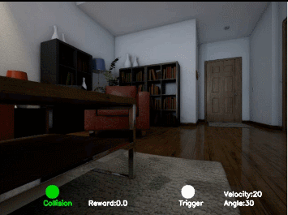
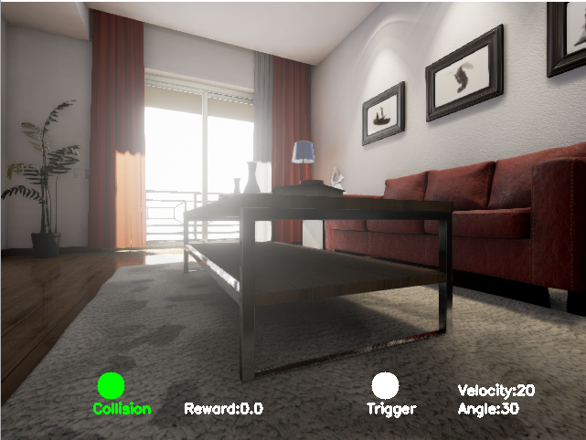

Integrate UnrealCV with Openai Gym for Reinforcement Learning(RL)
===

# Introduction
**This project integrates Unreal Engine with OpenAI Gym for visual reinforcement learning based on [UnrealCV](http://unrealcv.org/).**
In this project, you can run your RL algorithms in various realistic UE4 environments easily without any knowledge of Unreal Engine and UnrealCV.
The framework of this project is shown as below:


- ```UnrealCV``` is the basic bridge between ```Unreal Engine``` and ```OpenAI Gym```.
- ```OpenAI Gym``` is a toolkit for developing RL algorithm, compatible with any numerical computation library, such as Tensorflow or Theano. 





Snapshots of RL based visual navigation for object searching and obstacle avoidance.

# Installation
## Dependencies
- UnrealCV
- Gym
- CV2
- Matplotlib
- Numpy
- Docker(Optional)
- Nvidia-Docker(Optional)
 
We recommend you to use [anaconda](https://www.continuum.io/downloads) to install and manage your python environment.
```CV2``` is used for images processing, like extracting object mask and bounding box.```Matplotlib``` is used for visualization.
## Gym-UnrealCV

Install gym-unrealcv
It is easy to install gym-unrealcv, just run
```buildoutcfg
git clone https://github.com/zfw1226/gym-unreal.git -b develop
cd gym-unrealcv
pip install -e . 
```
While installing gym-unrealcv, dependencies including [OpenAI Gym](https://github.com/openai/gym),unrealcv, numpy and matplotlib are installed.
Besides, opencv is needed to run.
```buildoutcfg
conda update conda
conda install --channel menpo opencv
```

## Prepare Unreal Environment
You need prepare an unreal environment to run the demo as below. You can do it by running the script [RealisticRendering.sh](RealisticRendering.sh)
```buildoutcfg
sh RealisiticRendering.sh
```
To run environments based on ArchinteriorsVol2Scene1, you need run script [Arch1.sh](Arch1.sh) to get the ArchinteriorsVol2Scene1 binary.
```buildoutcfg
sh Arch1.sh
```

There are two ways to run the unreal environment in gym-unrealcv. One need install [docker](https://docs.docker.com/engine/installation/linux/ubuntu/#install-from-a-package) and [nvidia-docker](https://github.com/NVIDIA/nvidia-docker), another do not need install anything else.
Currently the docker-free version only support running an unreal environment in a computer for the confliction of server IP.
If you need running multiple unreal environments in a computer in parallel, [nvidia-docker](https://github.com/NVIDIA/nvidia-docker) and [docker](https://docs.docker.com/engine/installation/linux/ubuntu/#install-from-a-package) are required.

**To make gym-unrealcv easy to run, the default config do not need install ``Docker``.**

### Run without Docker
There is nothing required to be installed.

### Run with Docker
For the reason that ```nvidia-docker``` supports ```Linux```  and ```Nvidia GPU```only , you will have to install and run our openai-gym environment in ```Linux``` system with ```Nvidida GPU```.
As the unreal environment with UnrealCV runs inside Docker containers, you are supposed to install [docker](https://docs.docker.com/engine/installation/linux/ubuntu/#install-from-a-package) first. If you use Linux, you can run scripts as below:
```
curl -sSL http://acs-public-mirror.oss-cn-hangzhou.aliyuncs.com/docker-engine/internet | sh -
```
Once docker is installed successfully, you are able to run ```docker ps``` and get something like this:
```
$ docker ps
CONTAINER ID        IMAGE               COMMAND             CREATED             STATUS              PORTS               NAMES
```

To speed up the frame rate of the environment, you need install [nvidia-docker](https://github.com/NVIDIA/nvidia-docker/wiki) to utilize NVIDIA GPU in docker.
```
wget -P /tmp https://github.com/NVIDIA/nvidia-docker/releases/download/v1.0.1/nvidia-docker_1.0.1-1_amd64.deb
sudo dpkg -i /tmp/nvidia-docker*.deb && rm /tmp/nvidia-docker*.deb
```
Test nvidia-docker
```
nvidia-docker run --rm nvidia/cuda nvidia-smi
```
You should be able to get the same result as you run ```nvidia-smi``` in your host.

And Then, [docker-py](https://github.com/docker/docker-py) a python library for the Docker Engine API is required to manage docker in python.
```buildoutcfg
pip install docker
```

**To use ``nvidia-docker``, you need modify variable ``use_docker`` to ``True``in [gym_unrealcv/__init__.py](./gym_unrealcv/__init__.py)**

# Usage
## Run a random agent

Once ```gym-unrealcv``` is installed successfully, you will see that your agent walking randomly in first-person view, after you run:
```
cd example/random
python random_agent.py
```
It will take a few minutes for the image to pull if you runs environment based on docker at the first time. 
After that, if all goes well，a predefined gym environment ```Search-RrMultiPlantsDiscreteTest-v0``` will be launched.
And then you will see that your agent is moving around the realistic room randomly.

## Training a reinforcement learning agent
Besides, we provide an example to train an agent to visual navigation by searching for specific object and avoiding obstacle simultaneously in ``Search-RrMultiPlantsDiscreteTest-v0`` environement using [Deep Q-Learning](https://www.cs.toronto.edu/~vmnih/docs/dqn.pdf).
### Dependences
To run this example, you should make sure that you have installed all the dependences. We recommend you to use [anaconda](https://www.continuum.io/downloads) to install and manage your python environment.
- Keras(Tested with v1.2)
- Theano or thensorflow

To use Keras(v1.2), you should run
```
pip install keras==1.2
```
Please see [this instruction](https://keras.io/backend/) to switch backend between ```Theano``` and ```Tensorflow```

If you use  the ```Theano``` backend, please see [this instruction](http://deeplearning.net/software/theano/library/config.html) to config gpu.

If you use ```Tensorflow```backend, please set ```DEVICE_TF``` in [constants.py](./example/dqn/constants.py) to config gpu.


### Training an agent
You can start the training process with default parameters by running the following script:
```
cd example/dqn
python run.py
```
You can change some parameteters in [constants.py](./example/dqn/constants.py)
if you set ```SHOW``` is ```True```, You will see a window like this to monitor the agent while training:

<div align="center">



</div>

- While the ```Collision``` button turning red, a collision is detected.
- While the ```Trigger``` button turning red, the agent is taking an action to ask the environment if it is seeing the target in a right place. 

if you set ```Map``` is ```True```, you will see a window showing the trajectory of the agent like this:

<div align="center">


</div>

- The ```green points``` represent where the agents realized that they had found a good view to observe the target object and got positive reward from  the environment.At the same time, the episode is finished. 
- The ```purple points``` represent where collision detected collision, agents got negative reward. At the same time, the episode terminated. 
- The ```red points``` represent where the targets are.
- The ```blue points``` represent where the agent start in a new episode.
- The ```red lines```  represent the trajectories that the agents found taget object sucessfully in the end.
- The ```black lines``` represent the trajectories of agents that did not find the target object in the end.
- The ```blue line``` represents the trajectory of agent in the current episode.

You can change the architecture of DQN in [dqn.py](./example/dqn/dqn.py) 

Visualization
===
You can display a graph showing the history episode rewards by running the following script:
```
cd example/utility
python reward.py -p ../dqn/log/monitor/tmp -a -d
```


You can display a graph showing the trajectory by running the following script:
```
cd example/utility
python trajectory.py -p ../dqn/log/trajectory.csv
```


- The ```green points``` represent where the agents realized that they had found a good view to observe the target object and got positive reward from  the environment.At the same time, the episode is finished. 
- The ```purple points``` represnet where collision detected collision, agents got negative reward. At the same time, the episode terminated. 
- The ```red lines```  represent the trajectories that the agents found taget object sucessfully in the end.
- The ```black lines``` represent the trajectories of agents that did not find the target object in the end.


