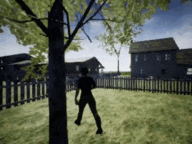
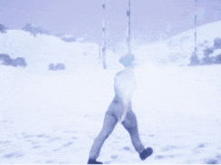

Gym-UnrealCV: Realistic virtual worlds for visual reinforcement learning
===

# Introduction
**This project integrates Unreal Engine with OpenAI Gym for visual reinforcement learning based on [UnrealCV](http://unrealcv.org/).**
In this project, you can run (Multi-Agent) Reinforcement Learning algorithms in various realistic UE4 environments easily without any knowledge of Unreal Engine and UnrealCV.

A number of environments have been released for robotic vision tasks, including  `Active object tracking`, `Searching for objects`, and `Robot arm control`.

<table>
  <tr>
    <td>
      <figure>
        
        <figcaption>Tracking in Urban City with distractors</figcaption>
      </figure>
    </td>
    <td>
      <figure>
        
        <figcaption>Tracking in Garden</figcaption>
      </figure>
    </td>
    <td>
      <figure>
        
        <figcaption>Tracking in Snow Forest</figcaption>
      </figure>
    </td>
  </tr>
  <tr>
    <td>
      <figure>
        
        <figcaption>Tracking in Garage with distractors</figcaption>
      </figure>
    </td>
    <td>
      <figure>
        
        <figcaption>Search in RealisticRoom</figcaption>
      </figure>
    </td>
    <td>
      <figure>
        
        <figcaption>Robot Arm Control</figcaption>
      </figure>
    </td>
  </tr>
</table>

The framework of this project is shown as below:


- ```UnrealCV``` is the basic bridge between ```Unreal Engine``` and ```OpenAI Gym```.
- ```OpenAI Gym``` is a toolkit for developing RL algorithm, compatible with most of numerical computation library, such as TensorFlow or PyTorch. 


# Installation
## Dependencies
- UnrealCV
- Gym
- CV2
- Matplotlib
- Numpy
- Docker(Optional)
- Nvidia-Docker(Optional)
 
We recommend you to use [anaconda](https://www.continuum.io/downloads) to install and manage your python environment.
```CV2``` is used for images processing, like extracting object mask and bounding box. ```Matplotlib``` is used for visualization.
## Install Gym-UnrealCV

It is easy to install gym-unrealcv, just run
```
git clone https://github.com/zfw1226/gym-unrealcv.git
cd gym-unrealcv
pip install -e . 
```
While installing gym-unrealcv, dependencies including [OpenAI Gym](https://github.com/openai/gym), unrealcv, numpy and matplotlib are installed.
`Opencv` is should be installed additionally. 
If you use ```anaconda```, you can run
```
conda update conda
conda install --channel menpo opencv
```
or
```
pip install opencv-python
```

## Prepare Unreal Binary
Before running the environments, you need to prepare unreal binaries. 
You can load them from clouds by running [load_env.py](load_env.py)
```
python load_env.py -e {ENV_NAME}
```
`ENV_NAME` can be `RealisticRoom`, `RandomRoom`, `Arm`, etc. 
After that, it will automatically download a related env binary
to the [UnrealEnv](gym_unrealcv/envs/UnrealEnv) directory.

**Please refer the ``binary_list`` in [load_env.py](load_env.py) for more available example environments.**

# Usage
## 1. Run a Random Agent

Once ```gym-unrealcv``` is installed successfully, you will see that your agent is walking randomly in first-person view to find a door, after you run:
```
cd example/random
python random_agent.py -e UnrealSearch-RealisticRoomDoor-DiscreteColor-v0
```
After that, if all goes well，a pre-defined gym environment ```UnrealSearch-RealisticRoomDoor-DiscreteColor-v0``` will be launched.
And then you will see that your agent is moving around the room randomly.

We list the pre-defined environments in this [page](doc/EnvLists.md), for object searching and active object tracking. 

## 2. Learning RL Agents
To demonstrate how to train agent in gym-unrealcv, we provide [DQN](doc/dqn.md) (Keras) and [DDPG](doc/ddpg.md) (Keras) codes  in [.example](.example).

Moreover, you can also refer to some recent projects for more advanced usages, as following:
- [craves_control](https://github.com/zfw1226/craves_control) provides an example for learning to ``control a robot arm`` via **DDPG** (PyTorch).
- [active_tracking_rl](https://github.com/zfw1226/active_tracking_rl) provides examples for learning active visual tracking via **A3C** (Pytorch). The training framework can be used for ``single-agent RL``, ``adversarial RL``, and ``multi-agent games``.
- [pose-assisted-collaboration](https://github.com/LilJing/pose-assisted-collaboration) provides an example for learning multi-agent collaboration via **A3C** (Pytorch) in ``multiple PTZ cameras single target environments``.

# Customize an Environment
We provide a set of tutorials to help you get started with Gym-UnrealCV.
## 1. Modify the pre-defined environment
You can follow the [modify_env_tutorial](doc/config_env.md) to modify the configuration of the pre-defined environment.

## 2. Add a new unreal environment
You can follow the [add_new_env_tutorial](doc/addEnv.md) to add new unreal environment for your RL task.

# Papers Using Gym-UnrealCV
**🎉 Please feel free to pull requests or open an issue to add papers.**
- [Towards Active Vision for Action Localization With Reactive Control and Predictive Learning](https://arxiv.org/pdf/2202.10881.pdf), WACV 2022.
- [Coordinate-aligned multi-camera collaboration for active multi-object tracking](https://arxiv.org/pdf/2202.10881.pdf), Arxiv 2022.
- [Towards distraction-robust active visual tracking](http://proceedings.mlr.press/v139/zhong21b/zhong21b.pdf), ICML 2021.
- [AD-VAT+: An Asymmetric Dueling Mechanism for Learning and Understanding Visual Active Tracking](https://ieeexplore.ieee.org/abstract/document/8896000), TPAMI 2021.
- [Training an Agent to Find and Reach an Object in Different Environments using Visual Reinforcement Learning and Transfer Learning](https://www.scitepress.org/PublishedPapers/2021/102368/102368.pdf), ICAART 2021.
- [Pose-Assisted Multi-Camera Collaboration for Active Object Tracking](https://ojs.aaai.org/index.php/AAAI/article/view/5419), AAAI 2020.
- [Craves: Controlling robotic arm with a vision-based economic system](https://openaccess.thecvf.com/content_CVPR_2019/papers/Zuo_CRAVES_Controlling_Robotic_Arm_With_a_Vision-Based_Economic_System_CVPR_2019_paper.pdf), CVPR 2019.
- [End-to-end active object tracking and its real-world deployment via reinforcement learning](https://arxiv.org/pdf/1807.10342.pdf), TPAMI 2019.
- [An Improved Method Based on Deep Reinforcement Learning for Target Searching](https://ieeexplore.ieee.org/abstract/document/9043821), ICRAE 2019.
- [AD-VAT: An Asymmetric Dueling mechanism for learning Visual Active Tracking](https://openreview.net/pdf?id=HkgYmhR9KX), ICLR 2019.
- [End-to-end active object tracking via reinforcement learning](http://proceedings.mlr.press/v80/luo18a/luo18a.pdf), ICML 2018.

## Cite
If you use Gym-UnrealCV in your academic research, we would be grateful if you could cite it as follow:
```
@misc{gymunrealcv2017,
    author = {Fangwei Zhong, Weichao Qiu, Tingyun Yan, Alan Yuille, Yizhou Wang},
    title = {Gym-UnrealCV: Realistic virtual worlds for visual reinforcement learning},
    howpublished={Web Page},
    url = {https://github.com/unrealcv/gym-unrealcv},
    year = {2017}
}
```
## Contact
If you have any suggestion or interested in using Gym-UnrealCV, get in touch at [zfw1226 [at] gmail [dot] com](zfw1226@gmail.com).
