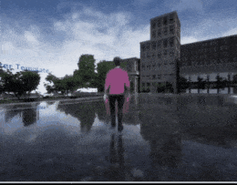
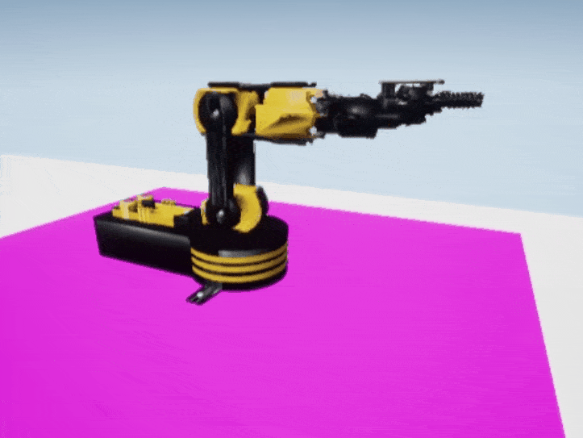
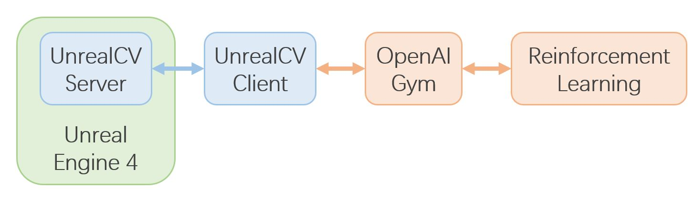

Gym-UnrealCV: Realistic virtual worlds for visual reinforcement learning
===

# Introduction
**This project integrates Unreal Engine with OpenAI Gym for visual reinforcement learning based on [UnrealCV](http://unrealcv.org/).**
In this project, you can run RL algorithms in various realistic UE4 environments easily without any knowledge of Unreal Engine and UnrealCV.

A number of environments have been released for robotic vision tasks, e.g. `Searching for objects`, `Active object tracking`, and `Control a robotic arm`.

<table>
   <tr>
<td></td>
<td></td>
<td></td>
   </tr>
</table>

The framework of this project is shown as below:


- ```UnrealCV``` is the basic bridge between ```Unreal Engine``` and ```OpenAI Gym```.
- ```OpenAI Gym``` is a toolkit for developing RL algorithm, compatible with most of numerical computation library, such as TensorFlow or PyTorch. 


# Installation
## Dependencies
- UnrealCV
- Gym
- CV2
- Matplotlib
- Numpy
- Docker(Optional)
- Nvidia-Docker(Optional)
 
We recommend you to use [anaconda](https://www.continuum.io/downloads) to install and manage your python environment.
```CV2``` is used for images processing, like extracting object mask and bounding box.```Matplotlib``` is used for visualization.
## Install Gym-UnrealCV

It is easy to install gym-unrealcv, just run
```
git clone https://github.com/zfw1226/gym-unrealcv.git
cd gym-unrealcv
pip install -e . 
```
While installing gym-unrealcv, dependencies including [OpenAI Gym](https://github.com/openai/gym), unrealcv, numpy and matplotlib are installed.
`Opencv` is should be installed additionally. 
If you use ```anaconda```,you can run
```
conda update conda
conda install --channel menpo opencv
```

## Prepare Unreal Binary
You need prepare an unreal binary to run the environment. 
You can do it by running [load_env.py](load_env.py)
```
python load_env.py -e {ENV_NAME}
```
`ENV_NAME` can be `RealisticRoom`, `RandomRoom`, `Arm`, etc. 
After that, it will automatically download a related env binary from [here](https://www.cs.jhu.edu/~qiuwch/unrealcv/binaries) 
to the [UnrealEnv](gym_unrealcv/envs/UnrealEnv) directory.

**Please refer the ``binary_list`` in [load_env.py](load_env.py) for more available example environments.**

# Usage
## Run a random agent

Once ```gym-unrealcv``` is installed successfully, you will see that your agent is walking randomly in first-person view to find a door, after you run:
```
cd example/random
python random_agent.py -e UnrealSearch-RealisticRoomDoor-DiscreteColor-v0
```
After that, if all goes well，a pre-defined gym environment ```UnrealSearch-RealisticRoomDoor-DiscreteColor-v0``` will be launched.
And then you will see that your agent is moving around the room randomly.

We list the pre-defined environments in this [page](doc/EnvLists.md), for object searching and active object tracking. 
# Tutorials
We provide a set of tutorials to help you get started with Gym-UnrealCV.
### 1. Modify the pre-defined environment
You can follow the [modify_env_tutorial](doc/config_env.md) to modify the configuration of the pre-defined environment.

### 2. Add a new unreal environment
You can follow the [add_new_env_tutorial](doc/addEnv.md) to add new unreal environment for your RL task.

### 3.   Training a reinforcement learning agent
Besides, we also provide examples, such as [DQN](doc/dqn.md) and [DDPG](doc/ddpg.md), to demonstrate how to train agent in gym-unrealcv.
 
## Cite
If you use Gym-UnrealCV in your academic research, we would be grateful if you could cite it as follow:
```
@misc{gymunrealcv2017,
    author = {Fangwei Zhong, Weichao Qiu, Tingyun Yan, Alan Yuille, Yizhou Wang},
    title = {Gym-UnrealCV: Realistic virtual worlds for visual reinforcement learning},
    howpublished={Web Page},
    url = {https://github.com/unrealcv/gym-unrealcv},
    year = {2017}
}
```
## Contact
If you have any suggestion or interested in using Gym-UnrealCV, get in touch at [zfw1226 [at] gmail [dot] com](zfw1226@gmail.com).


