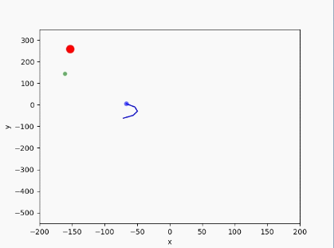
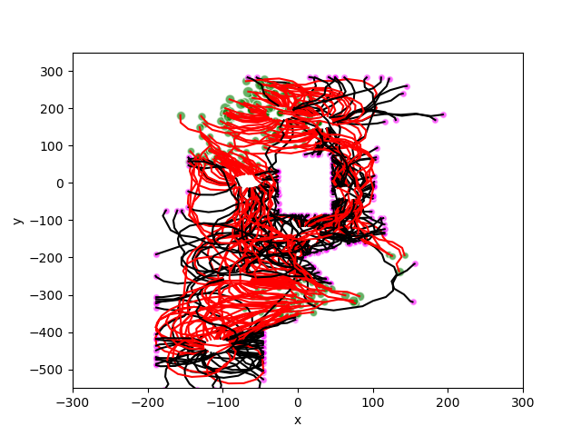

# Training a DQN Agent.
In this example, we will show you how to train an agent to search for specific target object and avoid obstacle simultaneously 
in ``Search-RrDoorDiscreteTest-v0`` environement using Deep Q-Learning.
### Dependences
To run this example, you should make sure that you have installed all the dependences. We recommend you to use [anaconda](https://www.continuum.io/downloads) to install and manage your python environment.
- Keras==v1.2
- Theano or thensorflow

To use Keras(v1.2), you should run
```
pip install keras==1.2
```
Please see [this instruction](https://keras.io/backend/) to switch backend between ```Theano``` and ```Tensorflow```

If you use  the ```Theano``` backend, please see [this instruction](http://deeplearning.net/software/theano/library/config.html) to config gpu.

If you use ```Tensorflow```backend, please set ```DEVICE_TF``` in [constants.py](./example/dqn/constants.py) to config gpu.


### Training an agent
You can start the training process with default hyper parameters by running the following commands:
```
cd example/dqn
python run.py
```
You can change some parameteters in [constants.py](./example/dqn/constants.py).
if you set ```SHOW``` to ```True```, You will see a window like this to monitor the agent while training:

<div align="center">


</div>

- While the ```Collision``` button turning red, a collision is detected.
- While the ```Trigger``` button turning red, the agent is taking an action to ask the environment if it is seeing the target in a right place. 

if you set ```Map``` to ```True```, you will see a window showing the trajectory of the agent like this:

<div align="center">



</div>

- The ```green points``` represent where the agents realized that they had found a good view to observe the target object and got positive reward from  the environment.At the same time, the episode is finished. 
- The ```purple points``` represent where collision detected collision, agents got negative reward. At the same time, the episode terminated. 
- The ```red points``` represent where the targets are.
- The ```blue points``` represent where the agent start in a new episode.
- The ```red lines```  represent the trajectories that the agents found taget object sucessfully in the end.
- The ```black lines``` represent the trajectories of agents that did not find the target object in the end.
- The ```blue line``` represents the trajectory of agent in the current episode.

You can change the architecture of DQN in [dqn.py](./example/dqn/dqn.py) 

Visualization
===
You can display a graph showing the history episode rewards by running the following script:
```
cd example/visualization
python reward.py -p ../dqn/log/monitor/tmp -a -d
```


You can also display a graph showing the trajectory by running the following script:
```
cd example/visualization
python trajectory.py -p ../dqn/log/trajectory.csv
```


- The ```green points``` represent where the agents realized that they had found a good view to observe the target object and got positive reward from  the environment.At the same time, the episode is finished. 
- The ```purple points``` represnet where collision detected collision, agents got negative reward. At the same time, the episode terminated. 
- The ```red lines```  represent the trajectories that the agents found taget object sucessfully in the end.
- The ```black lines``` represent the trajectories of agents that did not find the target object in the end.

